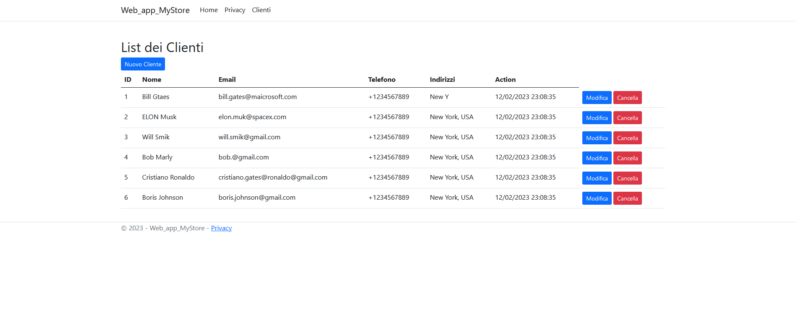
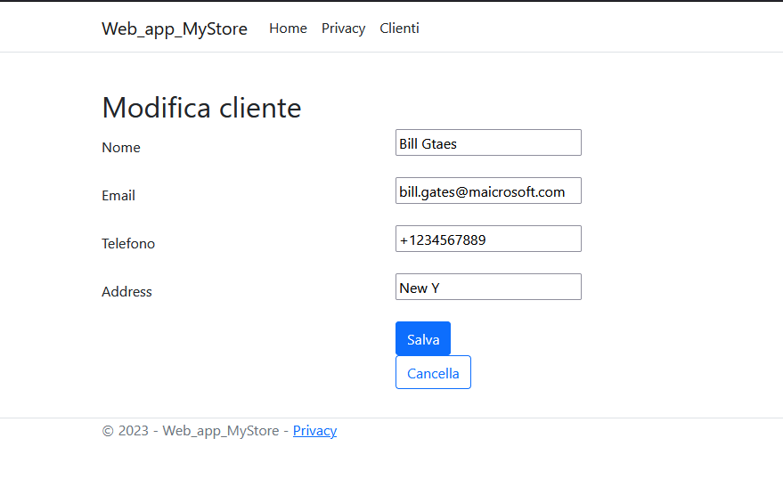

# ASP.NET Web Application With SQL Server and CRUD Operations Query @2023

### Create Database SQL
    CREATE DATABASE MyStore;    

### Table clients
    CREATE TABLE [dbo].[clients] (
        [id]        INT           IDENTITY (1, 1) NOT NULL,
        [name]      VARCHAR (100) NOT NULL,
        [email]     VARCHAR (150) NOT NULL,
        [phone]     VARCHAR (20)  NULL,
        [address]   VARCHAR (100) NULL,
        [create_at] DATETIME      DEFAULT (getdate()) NOT NULL,
        PRIMARY KEY CLUSTERED ([id] ASC)
    );

 

# Form Edit

